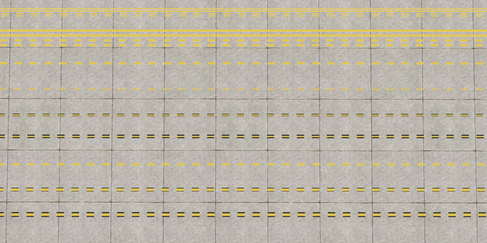
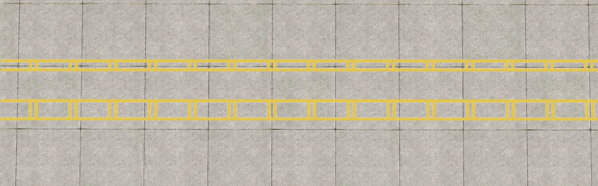

# ICAO Ground Poly Textures For Airport Design Editor (ADE)

## Preface:
ICAO (International Civil Aviation Organization) and ACI (Airports Council International) compilant pre-defined aerodrome marking textures for Scruffyduck's Airport Design Editor (ADE) Ground Polygon (GP) editor, for Microsoft Flight Simulator X / Lockheed Martin Prepar3D. Also textures can be used for other texturing purposes as well.

## Installation and Usage:

For installation and usage, please refer to wiki.
Wiki will be ready soon.

* Want to learn more about aerodrome ground markings? For articles and documentations, visit [Ibosoft Eğitim](https://egitim.ibosoft.net.tr/)

## Main Sources:
### Fonts:
For raw font files, please refer to this repository: [github.com/ibosoftnet/ICAO-Annex-14-Fonts](https://github.com/ibosoftnet/ICAO-Annex-14-Fonts)

### Reference Specifications:
* ICAO Annex 14, Aerodromes, Volume I - Aerodrome Design and Operations - 19th Ed., Amend. 17, July 2022
* ICAO Doc 9157, Aerodrome Design Manual, Part 4 - Visual Aids - 5th Ed., Amend. 1, Corr. 1, 2021
* ACI Apron Markings and Signs Handbook - 3rd Ed., 2017

## Available Textures:
For details, please refer to wiki.

* **Part 1/2/3 - Various ICAO/ACI line markings:**

<table style="width:75%;">
  <tr>
    <td style="width:50%; vertical-align:top;">
      
    </td>
    <td style="width:50%; vertical-align:top;">
      
      
    </td>
  </tr>
</table>

* **Part 4 - ICAO Annex 14 _Runway Designation Markings_:**

* **Part 5/6/7/8 - ICAO Annex 14 _Mandatory Instruction Markings and Information Markings_ in various colours:**

<table style="width:50%;">
  <tr>
    <td style="width:50%;"></td>
    <td style="width:50%;"></td>
  </tr>
  <tr>
    <td style="width:50%;"></td>
    <td style="width:50%;"></td>
  </tr>
</table>

* **Part 9 - Some pre-ready ACI texts:**

* **Part 10 - Some ACI _Apron Signs_:**

---

