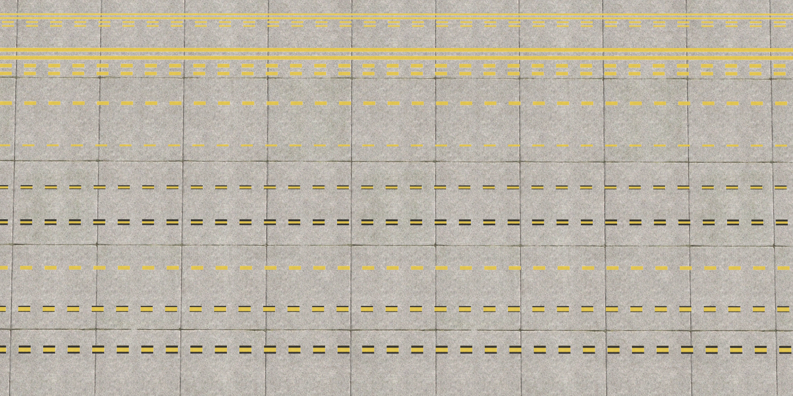
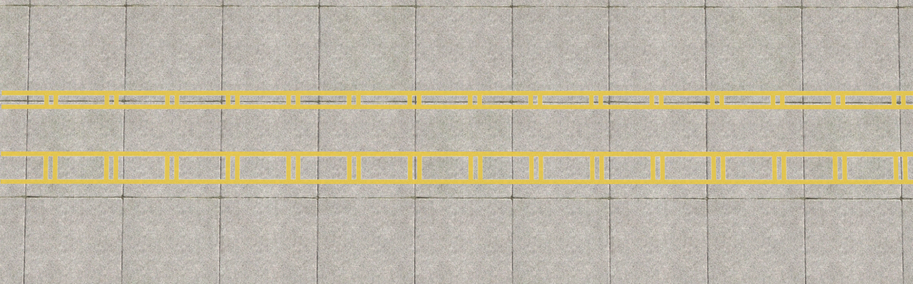

# ICAO Ground Poly Textures For Airport Design Editor (ADE)

## Preface:
ICAO (International Civil Aviation Organization) and ACI (Airports Council International) compilant pre-defined aerodrome marking textures for Scruffyduck's Airport Design Editor (ADE) Ground Polygon (GP) editor, for Microsoft Flight Simulator X / Lockheed Martin Prepar3D. Also textures can be used for other texturing purposes as well.

## Installation and Usage:

### Installation:
* Copy textures located at ```/Textures/24 Bit Mipmap``` to ```[ADE Installation Folder]\Textures_Dpy\``` - Theese are for previewing in ADE GP editor.
* Copy textures located at ```/Textures/DXT3 DDS``` to ```[ADE Installation Folder]\Textures\``` - Theese are for using in scenery. According to the ADE GP manual, these textures are added to the “Texture” folder located in the directory where you compiled the scenery. However, if ADE did not automatically include these textures, or if your Texture folder has a different name, you need to manually copy the textures into your scenery’s texture folder.
* Add the entries from ```\Definition Entries\Lines_Def.txt``` to ```[ADE Installation Folder]\Lines_Def.txt```, either at the **beginning** or the **end** of the file.
* Add the entries from ```\Definition Entries\Texture_Def.txt``` to ```[ADE Installation Folder]\Texture_Def.txt```, either at the **beginning** or the **end** of the file.


### Usage:


> **IMPORTANT**  
> In the **ADE GP Editor**, if the name of a line texture includes a **Total Width** value specified in **centimeters**, you must set the width of the line you use to that value.  
> This is because the pattern and spacing ratios of these lines are adjusted according to their total width.  
>
> If **Total Width = Adjustable**, the line does not contain a repeating pattern, so the aspect ratio does not matter, and you can use any width you prefer.


* Want to learn more about aerodrome ground markings? For articles and documentations, visit [Ibosoft Eğitim](https://egitim.ibosoft.net.tr/)

## Main Sources:
### Fonts:
For raw font files, please refer to this repository: [github.com/ibosoftnet/ICAO-Annex-14-Fonts](https://github.com/ibosoftnet/ICAO-Annex-14-Fonts)

### Reference Specifications:
* ICAO Annex 14, Aerodromes, Volume I - Aerodrome Design and Operations - 19th Ed., Amend. 17, July 2022
* ICAO Doc 9157, Aerodrome Design Manual, Part 4 - Visual Aids - 5th Ed., Amend. 1, Corr. 1, 2021
* ACI Apron Markings and Signs Handbook - 3rd Ed., 2017

## Available Textures:
For details, please refer to wiki.

* **Part 1/2/3 - Various ICAO/ACI line markings:**

<table style="width:75%;">
  <tr>
    <td style="width:50%; vertical-align:top;">
      
    </td>
    <td style="width:50%; vertical-align:top;">
      
      
    </td>
  </tr>
</table>

* **Part 4 - ICAO Annex 14 _Runway Designation Markings_:**


* **Part 5/6/7/8 - ICAO Annex 14 _Mandatory Instruction Markings and Information Markings_ in various colours:**

<table style="width:50%;">
  <tr>
    <td style="width:50%;"></td>
    <td style="width:50%;"></td>
  </tr>
  <tr>
    <td style="width:50%;"></td>
    <td style="width:50%;"></td>
  </tr>
</table>


* **Part 9 - Some pre-ready ACI texts:**


* **Part 10 - Some ACI _Apron Signs_:**


---

## Update Notes:
* **02 November 2024** - The location of the ACI Blue Line has been changed because it caused blue reflections with nearby lines in the texture file. Please update Part 1 textures and ACI Blue Line definition entries.

---